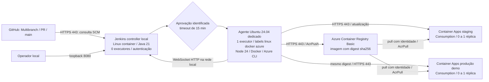

# E1 — Arquitetura planejada

O controller não recebe acesso ao daemon Docker. A porta 8080 fica restrita a 127.0.0.1 e a 50000 não é publicada; agente usa WebSocket. Em um host Linux separado, configure HTTPS e rede privada entre agente/controller antes de usar dados reais. O Compose atende um laboratório local, com agente iniciado no mesmo host/rede.

Um executor no agente evita concorrência no daemon Docker e reduz custo. O agente deve ser dedicado: acesso ao daemon equivale a acesso administrativo no host. Não executar PRs de autores desconhecidos nesse agente nem liberar credenciais de Azure para PRs. A aplicação usa apenas catálogo fictício; integração com ERP exigiria rede privada e autenticação próprias.

Agente Windows com label `windows dotnet` é uma extensão para legado, não é necessário para esta API Node. Não está configurado nem provisionado. Não há agentes cloud pagos nesta proposta.

GitHub webhook depende de endpoint HTTPS alcançável e autenticado/validado. Como o Jenkins é local, usar consulta SCM até configurar um endpoint seguro. Não expor 8080 nem criar túnel público sem revisão específica.
